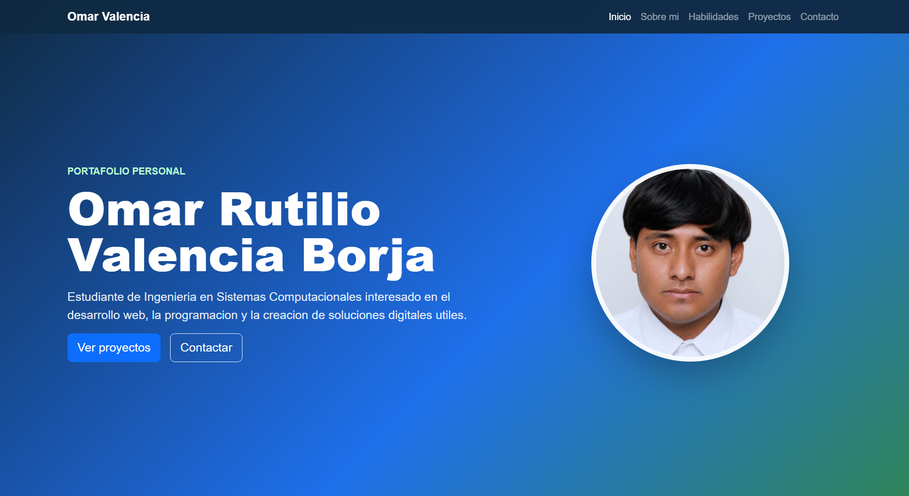
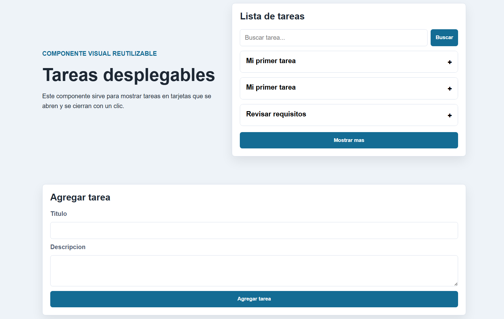

<div align="center">

TECNOLOGICO NACIONAL DE MEXICO

INSTITUTO TECNOLOGICO DE OAXACA

Departamento de Ingenieria en Sistemas Computacionales


Materia: Programacion Web

Actividad: Actividad 4. Portafolio personal con Bootstrap

Docente: Martinez Nieto Adelina

Grupo: 7SD

Alumno: Valencia Borja Omar Rutilio

Numero de control: 22161258

Oaxaca, Oaxaca, 06 de Julio de 2026

</div>

# Portafolio personal

## Nombre del proyecto

**Actividad4-Portafolio-Web**

## Descripcion breve

Este proyecto consiste en un portafolio personal desarrollado con HTML, CSS,
JavaScript y Bootstrap. Su finalidad es presentar informacion academica y
profesional del estudiante, incluyendo una fotografia de perfil, habilidades,
proyectos realizados y datos de contacto.

El portafolio fue creado como una pagina web responsiva, por lo que puede
visualizarse correctamente en computadora, tablet o telefono.

## Descripcion del proyecto

Para el desarrollo se utilizo **Bootstrap 5.3.3** como framework CSS principal.
Bootstrap permite trabajar con una estructura responsiva mediante contenedores,
filas, columnas, botones, tarjetas y barra de navegacion.

La plantilla tomada como referencia fue **Freelancer**, disponible en Start
Bootstrap. Esta plantilla se eligio porque esta pensada para portafolios
personales y cuenta con una estructura clara para presentar informacion,
proyectos y datos de contacto.

Link de Bootstrap:

https://getbootstrap.com/

Link de la plantilla utilizada:

https://startbootstrap.com/theme/freelancer

Aunque la plantilla fue la base de referencia, el diseno fue adaptado para una
presentacion academica: se modificaron colores, textos, secciones, tarjetas,
imagenes y distribucion del contenido.

## Menus y secciones del portafolio

El portafolio contiene un menu de navegacion superior con las siguientes
secciones:

### Inicio

Es la primera seccion del sitio. Presenta el nombre del estudiante, una breve
descripcion del perfil y una foto de presentacion. Tambien incluye botones para
ir directamente a los proyectos o a la informacion de contacto.

### Sobre mi

En esta seccion se describe el perfil academico del estudiante, la carrera que
cursa y los intereses relacionados con el desarrollo web, la programacion y el
diseno de interfaces.

### Habilidades

Muestra las habilidades principales relacionadas con la materia de Programacion
Web. Se incluyen conocimientos de HTML, CSS, Bootstrap, JavaScript y uso de
GitHub para organizar y publicar proyectos.

### Proyectos

Presenta tarjetas con trabajos o practicas realizadas durante el curso. Cada
tarjeta incluye una imagen, un titulo y una descripcion breve del proyecto.

### Contacto

Incluye informacion basica de contacto, como correo, perfil de GitHub y
ubicacion. Esta seccion permite que el portafolio funcione como una presentacion
personal y profesional.

## Proceso de creacion

1. Primero se creo la estructura general del proyecto con los archivos
   `index.html`, `README.md`, la carpeta `css`, la carpeta `js` y la carpeta
   `img`.

2. Despues se agrego Bootstrap mediante CDN dentro del archivo `index.html`.
   Esto permitio usar clases de Bootstrap sin instalar dependencias adicionales.

3. Se tomo como referencia la plantilla **Freelancer** de Start Bootstrap por
   su estructura enfocada en portafolios. A partir de esa idea se organizaron
   las secciones principales: inicio, sobre mi, habilidades, proyectos y
   contacto.

4. Se construyo la barra de navegacion con Bootstrap para que el usuario pueda
   moverse facilmente entre las secciones del portafolio. Tambien se hizo
   responsiva para que el menu se adapte en pantallas pequenas.

5. Se modifico la seccion de inicio para que mostrara el nombre del estudiante,
   una descripcion breve y una fotografia de perfil real. Esta parte se hizo
   visible desde el primer momento para cumplir con el objetivo de presentar al
   alumno.

6. Se agrego la seccion "Sobre mi" para explicar el perfil academico y los
   intereses profesionales. Esta seccion ayuda a que el portafolio no solo sea
   visual, sino tambien informativo.

7. Se creo la seccion de habilidades usando tarjetas. Se eligio este formato
   porque permite ordenar la informacion en bloques pequenos y faciles de leer.

8. Se agrego la seccion de proyectos con tarjetas e imagenes. Cada proyecto
   tiene una captura o imagen representativa, un titulo y una descripcion corta.

9. Se creo el archivo `css/portafolio.css` para personalizar el diseno. En este
   archivo se cambiaron colores, tamanos, espaciados, estilos de tarjetas,
   apariencia de la foto de perfil y ajustes para dispositivos moviles.

10. Se agrego el archivo `js/portafolio.js` para mejorar el comportamiento del
    menu en dispositivos moviles. Al seleccionar una opcion del menu, este se
    cierra automaticamente.

11. Finalmente se completo el README con la portada, descripcion del proyecto,
    framework utilizado, plantilla, secciones, proceso de creacion, capturas y
    enlaces del repositorio y GitHub Pages.

## Estructura del proyecto

```text
Actividad4/
  index.html
  README.md
  css/
    portafolio.css
  js/
    portafolio.js
  img/
    foto-perfil.jpg
    logoportada.png
    proyecto-componente.png
    proyecto-html-css.png
    proyecto-portafolio.png
```

## Capturas de pantalla

### Vista principal del portafolio



### Proyecto HTML y CSS


### Proyecto de componente reutilizable



## Enlaces

Repositorio en GitHub:

https://github.com/omarferxoo/Actividad4-Portafolio-Web

Sitio publicado en GitHub Pages:

https://omarferxoo.github.io/Actividad4-Portafolio-Web/
